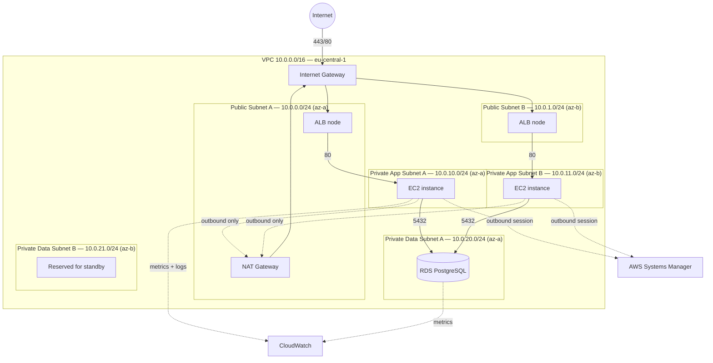

# Architecture

## Overview

A three-tier AWS environment in eu-central-1 (Frankfurt), defined in
Terraform and provisioned on demand. Public traffic reaches an
Application Load Balancer in public subnets; application instances run
in private subnets with no public IP addresses; a managed PostgreSQL
database sits in a separate isolated subnet tier.

## Diagram

## Network Layout

| Tier | CIDR (az-a / az-b) | Routes to internet | Reachable from |
|------|--------------------|--------------------|----------------|
| Public | 10.0.0.0/24 / 10.0.1.0/24 | Yes, via IGW | Internet (ALB only) |
| Private app | 10.0.10.0/24 / 10.0.11.0/24 | Outbound only, via NAT | ALB security group |
| Private data | 10.0.20.0/24 / 10.0.21.0/24 | No route to internet | App security group |

The VPC uses 10.0.0.0/16, leaving room to add tiers without
renumbering. Each subnet is a /24 (251 usable addresses after AWS
reserves five), which is far more than needed but keeps the addressing
readable.

## Traffic Flow

1. Client resolves the ALB DNS name and connects on 443/80
2. ALB terminates the connection and forwards to a healthy target on
   port 80 in a private app subnet
3. The application connects to RDS on 5432 within the VPC
4. Outbound traffic from app instances (package installs, AWS APIs)
   exits via the NAT Gateway; nothing can initiate a connection inward

## Access Model

Administrative access uses AWS Systems Manager Session Manager. There
is no bastion host, no SSH port open on any security group, and no SSH
key material in this repository. Instances reach SSM through outbound
connections only. Sessions are recorded in CloudTrail.

## Security Group Chain

| Security group | Inbound | Source |
|----------------|---------|--------|
| ALB | 80, 443 | 0.0.0.0/0 |
| App | 80 | ALB security group |
| Database | 5432 | App security group |

Rules reference security group IDs rather than CIDR ranges, so they
remain correct as instances are replaced by the autoscaling group.

## Known Limitations

- **Single NAT Gateway.** Production designs use one per AZ. This is a
  deliberate cost decision and a single point of failure for outbound
  traffic from the private tiers.
- **Single-AZ RDS.** No automatic failover. Cost decision.
- **No HTTPS certificate initially.** ACM certificates require a domain
  in Route 53; added only if a domain is available.